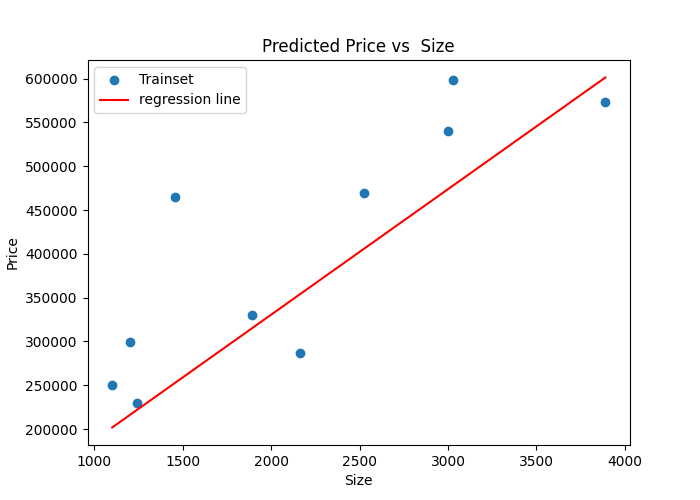

# Multiple variable Linear Regression -- from scratch & Sklearn
this project implements linear regression based on two variable ( size , bedrooms )
to predict output ( price )

## Features
- Data preprocessing and displays the data
- splits the datasets to training and testing set by sklearn
- trains a multiple linear regression model bt sklearn `lin_reg.fit( x_train , y_train )`
- predicts house's price based on its size and number of bedrooms
- Evaluates the model using R^2 score
- Visualization the regression results

## Dataset Structure

### Dataset Source

- The dataset used in this project is from Andrew Ng's Machine Learning course programming exercises.
- **File:** [mul_var_lin_reg.csv](data/mul_var_lin_reg.csv)

The model trains on a three-column dataset (`mul_var_lin_reg.csv`):

- **Size**: House's Size (independent variable X).
- **bedrooms**: Number of bedrooms (independent variable X).
- **Price**: House's Price (dependent variable y).


## implementation details
- fetches libraries used in project
- load and read the data 
- names the columns
- converting into numeric
- function to show the data
- splits columns to features and target
- splits the data to training and test set by sklearn
- trains the model 
- predicting House's Price
- uses R^2 to evaluate the model 
- visualizes a graph for predicted price vs Size of house with bedrooms equals three

## Results
- predicted price for house's size equals 2000 M and 3 bedrooms =  330662.99k
- Train R* =  0.7691
- test R* =  0.5149


## Visualization
this figure below shows the fitted line regression on the traning set




## Usage

Run the project using:

```bash
python mul_reg_file.py
```
####the program will:
- load the dataset
- displays the data
- splits the data to train and test set
- predicts House's price
- Evaluate the model by R^2 score
- visualizes a graph to linear regression line with train data

## Library used:
- Numpy
- pandas
- matplotlib
- sklearn
- os

## Note
the project is for educational purposes only
